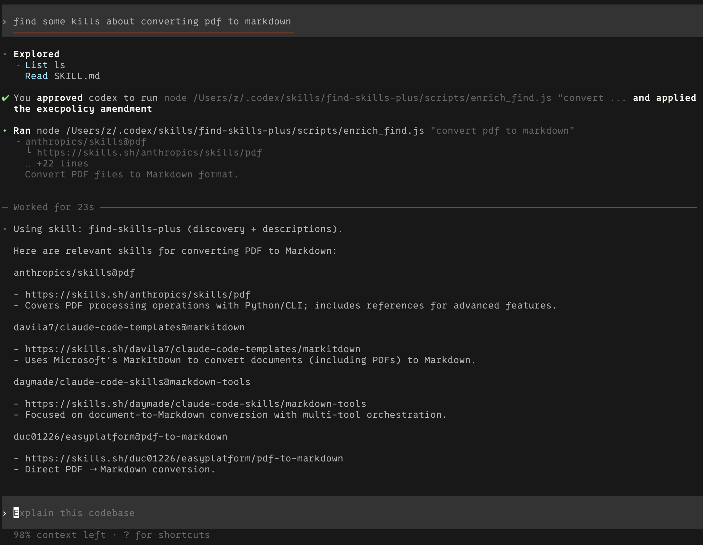

# Find Skills Plus

This skill searches the skills registry and enriches each result with a description.

## Install

```bash
npx skills add yinhui1984/find_skills_plus
```

## When to Use

Use this skill when the user asks to discover skills and wants more than just a list (e.g., asks for descriptions, comparisons, or short summaries).

## How It Works

1) Runs `npx skills find <query>` to get matching skills. Thanks to "[find-skills](https://github.com/vercel-labs/skills)"
2) For each result, fetches the skills.sh page and extracts a description (first non-empty paragraph).
3) Prints results in an easy-to-scan format.

## Run

```bash
node scripts/enrich_find.js "<query>"
```

## Example


